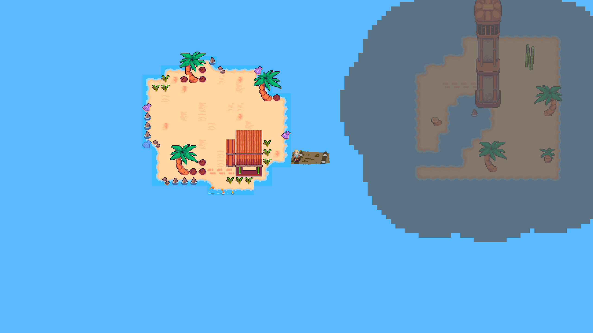
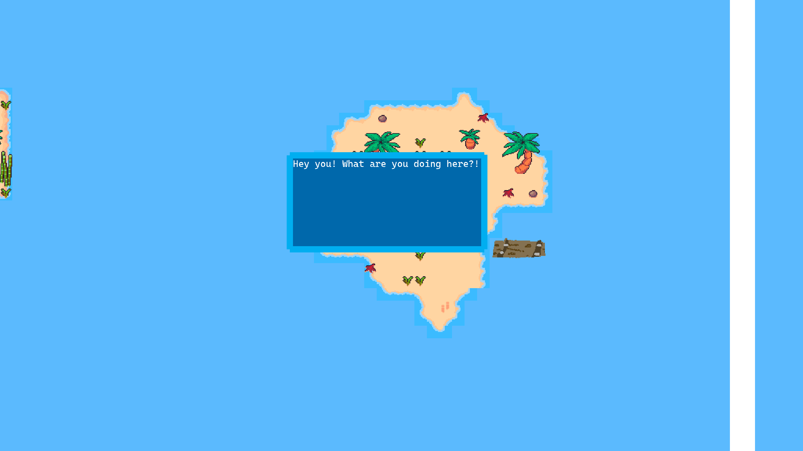
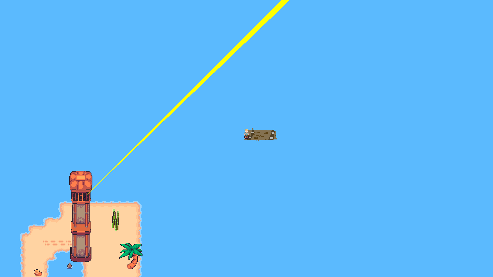

# README

## About

*My Brother's Lightkeeper*, a game created for EAE-3720 Alternative Game Development Summer 2024 at the University of Utah.

The sea is an oft-used metaphor for life in the Judaeo-Christian world. A large point of inspiration for the themes and motifs of *My Brother's Lightkeeper* is the Christian hymn *Brightly Beams Our Father's Mercy*, a song about our role as individuals in helping others through the struggles of life. *My Brother's Lightkeeper* seeks to explore the needs and responsibilities of mortals in a broken world through placing the player in a treacherous sea, where they will be aided in the dark by other light keepers and presented with opportunities to aide others as they sail towards a hopeful shore.

```txt
Trim your feeble lamp, my brother; Some poor sailor, tempest-tossed,

Trying now to make the harbor, In the darkness may be lost.

Let the lower lights be burning; Send a gleam across the wave.

Some poor fainting, struggling seaman You may rescue, you may save.
```

The player moves from region to region, talking to other seafarers, finding map fragments that unshroud the lighthouses, and lighting each lighthouse to get to the next region.\
The game features some light procedural generation to make each play through a little bit different.

## Screenshots







| Basic info | ---     |
| ---------- | ------- |
| Platform   | Windows |
| Players    | 1       |

## How To Play

Gamepad/controller recommended.

| Gamepad (Xbox buttons shown) | Keyboard | Action                          |
| ---------------------------- | -------- | ------------------------------- |
| LS                           | WASD     | Move                            |
| X                            | F        | Interact/Advance dialog (press) |
| B                            | X        | Back/Exit dialog (press)        |

## Authors

- Kobe Riddle -- Engineering, Product Owner, Design, Environmental art
- Timothy Quin Richards -- Design, Production, Sound, Environmental art

## Attributions

Clockwork Raven: Tile set and base sprite for the characters, which were drawn over for each character.\
[https://www.patreon.com/clockworkravenstudios/posts](https://www.patreon.com/clockworkravenstudios/posts)
